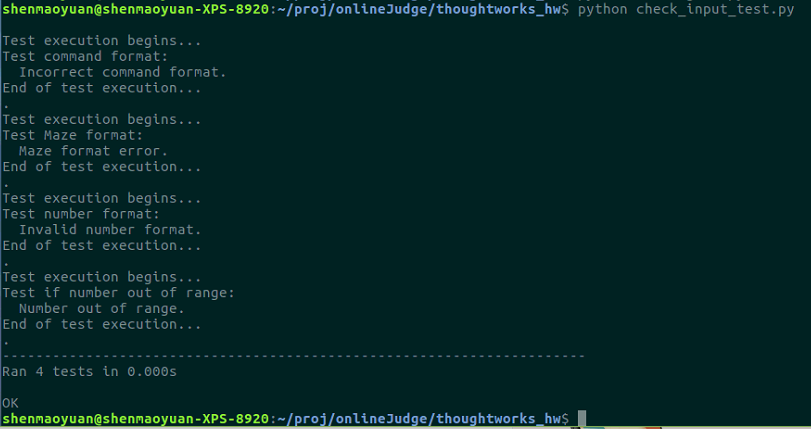

# thoughtworks_hw


## Environment:

* Ubuntu 16.04 LTS
* Python 3.6.4


## Test:

```
# Test Render Grid
python rendergrid.py
```


```
# Check the validity of the input
python check_input_test.py
```

